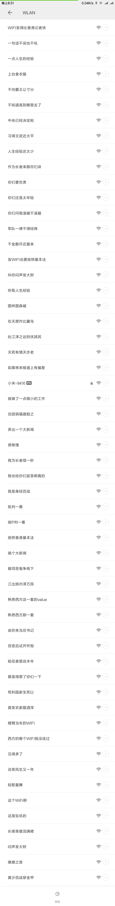

# NetWorkAttackTools

网络安全小工具

## 项目列表

工具|介绍
---|---
ARP 攻击|使用 RAW Socket 发送伪装的 ARP 帧，使得目标主机无法定位正确的网关，从而实现中断目标机网络的功能。
802.11 Beacon 帧发送|在 802.11 无线标准中，终端机可以通过 Beacon 帧来发现 AP，所以一个拥有无线网卡的恶意主机可以通过 `疯狂广播 Beacon 帧` 来实现信道干扰和~~SSID 广告位招租~~等功能；这个工具则是一个广播 AP 的例程，主要可以通过无线网卡广播 SSID(自订，不限数量)，但是前提是网卡可以进入 `Monitor` 模式，[这里](./Beacon_Attack/argv.sh)提供了一个脚本供参考。

## 示例

802.11 Beacon 帧发送工具

